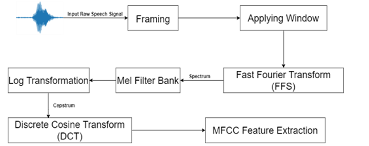

# Speech Recognition with CNN

Deep learning methods have become paramount in classification tasks. They are frequently employed for image and sound classification. Recently, there's a growing interest in human speech sound classification using deep learning to enhance speech recognition models and the human-computer interaction experience.

This project delves into the evolution of speech recognition and the underpinnings of Convolutional Neural Networks (CNN) in deep learning. It then establishes a complete CNN architecture. Through iterative testing, it gauges the impact of structural parameters of both one-dimensional (1D) and two-dimensional (2D) CNNs on accuracy. The culmination of this project is finding an optimal CNN configuration to train on spoken digit datasets and furthering this by performing automatic speech recognition using voices from varied individuals.

## Table of Contents
- [Installation](#installation)
- [Usage](#usage)
- [License](#license)

## Installation

To set up the project, install the required packages using:

```bash
pip install -r requirements.txt
```

## Usage

1. **Training**: 
   - For 1D CNN: `python model_train_1dcnn.py`
   - For 2D CNN: `python model_train_2dcnn.py`
2. **Model Architecture**:
   - 1D CNN Model: Refer to `model_1cnn.py`
   - 2D CNN Model: Refer to `model_2dcnn.py`
3. **Feature Extraction**:
   - For 1D CNN: Refer to `get_mfcc_1dcnn.py`
   - For 2D CNN: Refer to `get_mfcc_2dcnn.py`

 <br><br>


   

<td width=27.5% align="center">Process of MFCC feature extraction


